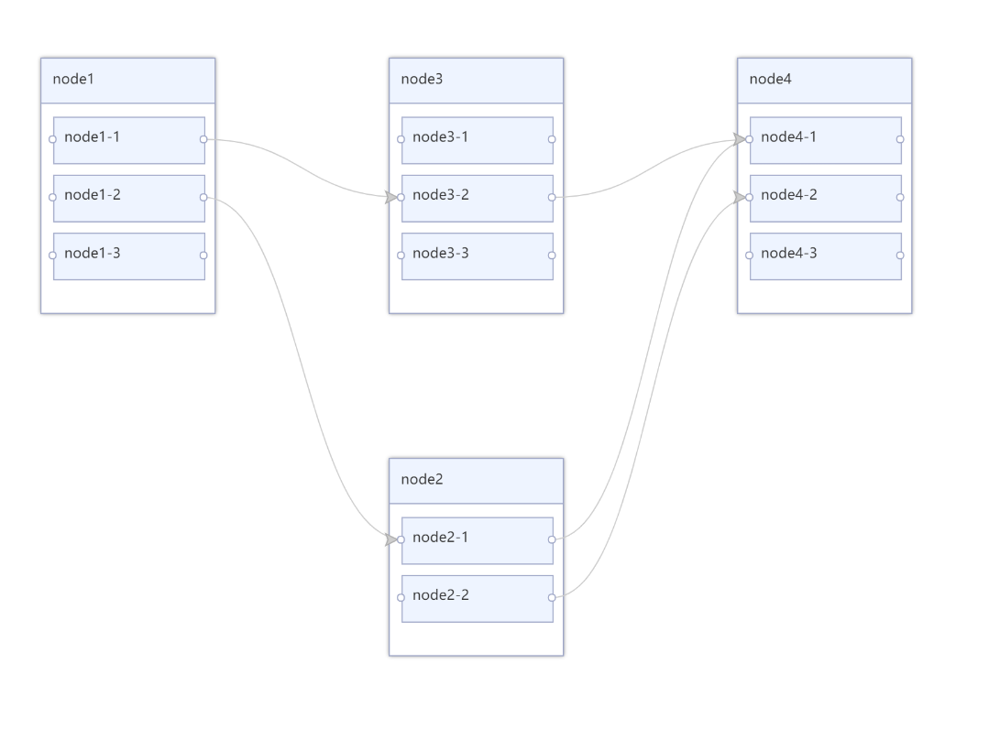

---
nav:
  title: 组件
  path: /components
group:
  title: RG6Group
  order: 1
---

## RG6Group

基于 antv/g6 和 dagre 层级关系布局，进行数据可视化开发。

### 何时使用

- `RG6Group`组件是为了满足，需要展示不同群组中子节点之间的关系的数据可视化。
- 简化了 antv/g6 的节点样式配置和交互配置。

### 前提条件

<!--  -->

- 安装 antv/g6 3.5.10 版本 和 dagre

```javascript
npm i antv/g6@3.5.10 dagre --save
```

### 代码演示

- 基础用法

```tsx
import React, { useRef, useEffect } from 'react';
import { RG6Group } from '@bdfe/rcomponents';
const data = {
  nodes: [
    {
      id: 'node1',
      label: 'node1',
      x: 100,
      y: 200,
      children: [
        {
          id: 'node1-1',
          label: 'node1-1',
        },
        {
          id: 'node1-2',
          label: 'node1-2',
        },
        {
          id: 'node1-3',
          label: 'node1-3',
        },
      ],
    },
    {
      id: 'node2',
      label: 'node2',
      status: 'done',
      x: 300,
      y: 200,
      children: [
        {
          id: 'node2-1',
          label: 'node2-1',
        },
        {
          id: 'node2-2',
          label: 'node2-2',
        },
      ],
    },
    {
      id: 'node3',
      label: 'node3',
      x: 200,
      y: 100,
      children: [
        {
          id: 'node3-1',
          label: 'node3-1',
        },
        {
          id: 'node3-2',
          label: 'node3-2',
        },
        {
          id: 'node3-3',
          label: 'node3-3',
        },
      ],
    },
    {
      id: 'node4',
      label: 'node4',
      x: 200,
      y: 100,
      children: [
        {
          id: 'node4-1',
          label: 'node4-1',
        },
        {
          id: 'node4-2',
          label: 'node4-2',
        },
        {
          id: 'node4-3',
          label: 'node4-3',
        },
      ],
    },
  ],
  // 边集
  edges: [
    {
      source: 'node1-2',
      target: 'node2-1',
    },
    {
      source: 'node1-1',
      target: 'node3-2',
    },
    {
      source: 'node3-2',
      target: 'node4-1',
    },
    {
      source: 'node2-2',
      target: 'node4-2',
    },
    {
      source: 'node2-1',
      target: 'node4-1',
    },
  ],
};
export default () => {
  return (
    <div style={{ width: '100%', height: 400 }}>
      <RG6Group nodes={data.nodes} edges={data.edges} />
    </div>
  );
};
```

- 自定义节点样式

```tsx
import React, { useRef, useEffect } from 'react';
import { RG6Group } from '@bdfe/rcomponents';
import { NodeModalItem } from './interface';
const [nodeWidth, nodeHeight] = [200, 40];
const raGroupConfig: NodeModalItem = {
  type: 'RaGroupDemo',
  anchorPoints: {
    positions: [
      [0.5, 0],
      [0.5, 1],
    ],
    shape: {
      base: 'rect',
      name: 'anchor',
      style: {
        width: 10,
        height: 10,
        stroke: '#f00',
        fill: '#fff',
      },
      x: -5,
      y: -5,
    },
  },
  shap: {
    base: 'rect',
    name: 'border',
    style: {
      stroke: '#f00',
      fill: '#fff',
      shadowColor: '#eee',
      shadowBlur: 10,
      lineWidth: 1,
    },
    x: 0,
    y: 0,
    innerShaps: [
      {
        base: 'rect',
        name: 'background',
        style: {
          width: ({ titleWidth }) => titleWidth - 2,
          height: ({ titleHeight }) => titleHeight - 2,
          stroke: '#00f',
          fill: '#00f',
          lineWidth: 1,
        },
        x: 1,
        y: 1,
        innerShaps: [
          {
            base: 'circle',
            name: 'status',
            style: {
              r: ({ titleHeight }) => titleHeight / 4,
              fill: node => {
                if (node.status === 'done') {
                  return '#f00';
                }
                return '#0f0';
              },
            },
            x: ({ titleHeight }) => titleHeight / 4 + 5,
            y: ({ titleHeight }) => titleHeight / 2,
          },
          {
            base: 'text',
            name: 'label',
            x: ({ titleHeight }) => titleHeight / 2 + 10,
            y: ({ titleHeight }) => titleHeight / 2 + 8,
            style: {
              fill: '#fff',
              text: node => {
                return (node.label || '').substr(0, 3);
              },
            },
          },
        ],
      },
    ],
  },
};
const data = {
  nodes: [
    {
      id: 'node1',
      label: 'node1',
      x: 100,
      y: 200,
      type: 'RaGroupDemo',
      children: [
        {
          id: 'node1-1',
          label: 'node1-1',
        },
        {
          id: 'node1-2',
          label: 'node1-2',
        },
        {
          id: 'node1-3',
          label: 'node1-3',
        },
      ],
    },
    {
      id: 'node2',
      label: 'node2',
      status: 'done',
      x: 300,
      y: 200,
      type: 'RaGroupDemo',
      children: [
        {
          id: 'node2-1',
          label: 'node2-1',
        },
        {
          id: 'node2-2',
          label: 'node2-2',
        },
      ],
    },
    {
      id: 'node3',
      label: 'node3',
      x: 200,
      y: 100,
      type: 'RaGroupDemo',
      children: [
        {
          id: 'node3-1',
          label: 'node3-1',
        },
        {
          id: 'node3-2',
          label: 'node3-2',
        },
        {
          id: 'node3-3',
          label: 'node3-3',
        },
      ],
    },
    {
      id: 'node4',
      label: 'node4',
      x: 200,
      y: 100,
      type: 'RaGroupDemo',
      children: [
        {
          id: 'node4-1',
          label: 'node4-1',
        },
        {
          id: 'node4-2',
          label: 'node4-2',
        },
        {
          id: 'node4-3',
          label: 'node4-3',
        },
      ],
    },
  ],
  // 边集
  edges: [
    {
      source: 'node1-2',
      target: 'node2-1',
    },
    {
      source: 'node1-1',
      target: 'node3-2',
    },
    {
      source: 'node3-2',
      target: 'node4-1',
    },
    {
      source: 'node2-2',
      target: 'node4-2',
    },
    {
      source: 'node2-1',
      target: 'node4-1',
    },
  ],
};
export default () => {
  return (
    <div style={{ width: '100%', height: 400 }}>
      <RG6Group
        nodes={data.nodes}
        edges={data.edges}
        nodeConfigs={[raGroupConfig]}
        grapConfig={{
          nodeCfg: { nodeWidth, nodeHeight, nodePadding: 10 },
        }}
      />
    </div>
  );
};
```

### API

#### RG6Props 组件接收参数

| 参数        | 说明                                                                     | 类型                                   | 默认值                            | 版本 |
| ----------- | ------------------------------------------------------------------------ | -------------------------------------- | --------------------------------- | ---- |
| onLoad      | 组件就绪的回调，会返回 g6 图 grap 对象，和组件实例暴露的 api（暂未开放） | `(grap: Grap, inst: GrapInst) => void` | -                                 |      |
| nodeConfigs | 自定义节点样式的配置，具体属性见下文                                     | `NodeModalItem[]`                      | `type: 'RaGroup', type: 'RaNode'` |      |
| grapConfig  | G6 初始化配置，见下文                                                    | `GrapConfig`                           | -                                 |      |
| nodes       | 节点数据，属性见下文                                                     | `NodeData[]`                           | -                                 |      |
| edges       | 关系数据，属性见下文                                                     | `EdgeData[]`                           | -                                 |      |

<!-- | onChange    | 图内进行节点或连线增删操作的回调（暂未开放）                             | `(data: GraphDataType) => void`                               | -                 |      |
| onSelect    | 选中节点的回调（暂未开放）                                               | `(type: EleType, current: Item, data: GraphDataType) => void` | -                 |      |
| onDelete    | 删除节点或连线的回调（暂未开放）                                         | `(type: EleType, current: Item, data: GraphDataType) => void` | -                 |      |
| edgeConfigs | 自定义连线样式的配置，具体属性见下文（暂未开放）                         | `EdgeModalItem[]`                                             | -                 |      | -->

#### NodeModalItem

| 参数          | 说明                                                   | 类型                                                                  | 默认值 | 版本 |
| ------------- | ------------------------------------------------------ | --------------------------------------------------------------------- | ------ | ---- |
| type          | 节点模型的名称                                         | `string`                                                              | -      |      |
| shap          | 节点形状和样式的描述，具体属性见`NodeShape`            | `NodeShape`                                                           | -      |      |
| adjustNode    | 节点渲染之后可以调整各个图形之间的位置关系、样式、内容 | `(node: ModelCfg, shaps: any[], grap: Grap) => void`                  | -      |      |
| onStateChange | 节点状态改变时的回调                                   | `(nodeItem: Item, node: ModelCfg, shaps: any[], grap: Grap,) => void` | -      |      |
| anchorPoints  | 节点的锚点设置                                         | `boolean or { positions?: number[][];shape?: NodeShape;}`             | -      |      |

#### NodeShape

| 参数       | 说明                                                                                                 | 类型                                                                                                       | 默认值 | 版本 |
| ---------- | ---------------------------------------------------------------------------------------------------- | ---------------------------------------------------------------------------------------------------------- | ------ | ---- |
| base       | g6 的基础形状 参见[antv/g6](https://g6.antv.vision/zh/docs/manual/middle/elements/nodes/defaultNode) | `'circle' or 'rect' or 'ellipse' or 'diamond' or 'triangle' or 'star' or 'image' or 'modelRect' or 'text'` | -      |      |
| name       | 节点模型的名称，节点数据中可以配置 type 后使用该模型                                                 | `string`                                                                                                   | -      |      |
| text       | `base` 为 `text` 的节点模型，配置文本的样式                                                          | `BaseValue`                                                                                                | -      |      |
| style      | 当前基础形状的样式，属性见下文                                                                       | `Style`                                                                                                    | -      |      |
| x          | 当前形状相对于上一级形状的横坐标                                                                     | `number or ((node: ModelCfg, grap: Grap, anchorIndex?: number) => number)`                                 | -      |      |
| y          | 当前形状相对于上一级形状的纵坐标                                                                     | `number or ((node: ModelCfg, grap: Grap, anchorIndex?: number) => number)`                                 | -      |      |
| innerShaps | 当前形状的内部嵌套形状                                                                               | `NodeShape[]`                                                                                              | -      |      |

#### Style

`type Style = { [key: string]: BaseValue }`

#### BaseValue

`type BaseValue = boolean| string| number| ((node: ModelCfg, grap: Grap, anchorIndex?: number) => string | number)`

#### GrapConfig

| 参数     | 说明                                                          | 类型            | 默认值 | 版本 |
| -------- | ------------------------------------------------------------- | --------------- | ------ | ---- |
| nodeCfg  | 节点模型的公共配置 具体属性见`GraphNodeCfg`                   | `GraphNodeCfg`  | -      |      |
| dagreCfg | 节点关系 dagre 工具配置 具体属性见`GraphDagreCfg`             | `GraphDagreCfg` | -      |      |
| 其他配置 | 参考[antv/g6-graph](https://g6.antv.vision/zh/docs/api/Graph) | -               | -      |      |

#### GraphNodeCfg

| 参数        | 说明             | 类型     | 默认值 | 版本 |
| ----------- | ---------------- | -------- | ------ | ---- |
| nodeWidth   | 子节点的宽度     | `number` | 150    |      |
| nodeHeight  | 子节点高度       | `number` | 40     |      |
| nodePadding | 子节点之间的距离 | `number` | 10     |      |

#### GraphDagreCfg

| 参数    | 说明                                                                                                                 | 类型                           | 默认值 | 版本 |
| ------- | -------------------------------------------------------------------------------------------------------------------- | ------------------------------ | ------ | ---- |
| rankdir | 布局的方向。T：top（上）；B：bottom（下）；L：left（左）；R：right（右）                                             | `'TB' or 'BT' or 'LR' or 'RL'` | 'LR'   |      |
| align   | 节点对齐方式。U：upper（上）；D：down（下）；L：left（左）；R：right（右）                                           | `'UL' or 'UR' or 'DL' or 'DR'` | 'UL'   |      |
| nodesep | 节点间距（px）。在 rankdir 为 'TB' 或 'BT' 时是节点的水平间距；在 rankdir 为 'LR' 或 'RL' 时代表节点的竖直方向间距   | `number`                       | 150    |      |
| ranksep | 层间距（px）。在 rankdir 为 'TB' 或 'BT' 时是竖直方向相邻层间距；在 rankdir 为 'LR' 或 'RL' 时代表水平方向相邻层间距 | `number`                       | 150    |      |

#### 其他自定义类型

说明：`GraphData`、`Node`、`Edge` 是 `antv/g6` 定义类型。参考[antv/g6-item](https://g6.antv.vision/zh/docs/api/nodeEdge/Item)

`type GraphDataType = GraphData`

`type NodeItem = Node & { id: string }`

`type EdgeItem = Edge & { source: string; target: string }`

`type NodeData = { id: string; [key: string]: any; }`

`type EdgeData = { source: string; target: string; [key: string]: any }`

`interface Point { x: number; y: number; [key: string]: any; }`

`type Item = NodeItem | EdgeItem`

`type EleType = 'node' | 'edge'`
